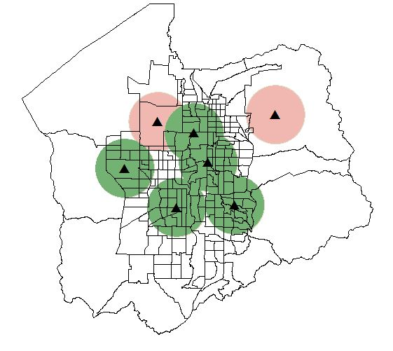

Overview
========

Allagash can be used to generate and solve spatial optimization problems using `GeoPandas <http://geopandas.org>`_ and `PuLP <https://pythonhosted.org/PuLP/>`_.

The focus is on coverage problems though other optimization models may be added over time. Coverage modeling is generally used to find the best spatial configuration of a set of facilities that provide some level of service to units of demand. It is often necessary to “cover” demand within a prescribed time or distance.

A simple use case is shown in the image below. Suppose we have 7 possible facility locations (represented by the black triangles) and need to locate 5 facilities so that we get the most coverage. We can apply the MCLP to find the best configuration that reaches the most people (black-outlined polygons, Census block groups that have population). The service areas shown in green represent the 5 facilities that were selected by the problem. The service areas shown in red, represent the 2 facilities that were not chosen. In this simple case it might be easy enough to try every possible configuration, but when we start to have hundreds to thousands of facilities, it becomes infeasible and an optimization problem must be used.

